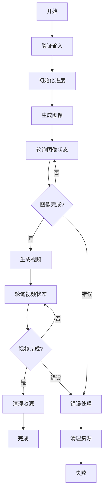

# GenVideoWorkflow - 图像到视频生成工作流

## 概述

`GenVideoWorkflow` 是一个基于 Temporal 的工作流，用于编排图像到视频的生成流程。该工作流集成了图像生成和视频生成功能，提供完整的端到端解决方案。

## 功能特性

### 🎯 核心功能
- **图像生成**: 基于文本提示生成高质量图像
- **视频生成**: 将生成的图像转换为视频（待实现）
- **进度跟踪**: 实时监控生成进度
- **错误处理**: 完善的错误处理和重试机制
- **资源管理**: 自动清理临时资源

### 🔧 技术特性
- **异步执行**: 基于 Temporal 的异步工作流
- **状态管理**: 完整的状态跟踪和查询
- **信号处理**: 支持取消和状态更新信号
- **类型安全**: 使用 Pydantic 模型确保类型安全

## 工作流步骤



## 使用方法

### 1. 基本使用

```python
from workflows import GenVideoWorkflow
from models.core_models import JobInput, Step

# 创建工作流输入
job_input = JobInput(
    prompt="一只可爱的小猫在花园里玩耍",
    style="realistic",
    job_type=Step.VIDEO,
    width=512,
    height=512,
    duration=5.0,
    user_id="user_123"
)

# 在 Temporal 客户端中启动工作流
result = await client.execute_workflow(
    GenVideoWorkflow.run,
    job_input,
    id="gen-video-workflow-123",
    task_queue="generation-queue"
)
```

### 2. 查询工作流状态

```python
# 获取工作流句柄
handle = client.get_workflow_handle("gen-video-workflow-123")

# 查询当前状态
status = await handle.query(GenVideoWorkflow.get_status)
print(f"当前步骤: {status['step']}")
print(f"进度: {status['percent']}%")
print(f"状态: {status['status']}")
```

### 3. 取消工作流

```python
# 发送取消信号
await handle.signal(GenVideoWorkflow.cancel_generation)
```

## 数据模型

### JobInput
```python
class JobInput(BaseModel):
    prompt: str              # 生成提示词
    style: str = "realistic" # 生成风格
    job_type: Step           # 任务类型
    width: int = 1024        # 图像宽度
    height: int = 1024       # 图像高度
    duration: float = 5.0    # 视频时长（秒）
    user_id: str             # 用户ID
    metadata: Dict = {}      # 额外元数据
```

### Progress
```python
class Progress(BaseModel):
    step: Step                    # 当前步骤
    status: JobStatus            # 当前状态
    percent: int                 # 完成百分比
    message: Optional[str]       # 进度消息
    error_message: Optional[str] # 错误消息
    asset_url: Optional[str]     # 资源URL
    estimated_completion: Optional[str] # 预计完成时间
```

## 状态和步骤

### 工作流步骤 (Step)
- `IMAGE`: 图像生成阶段
- `VIDEO`: 视频生成阶段
- `PROCESSING`: 处理中
- `COMPLETED`: 已完成
- `FAILED`: 失败

### 任务状态 (JobStatus)
- `PENDING`: 等待中
- `RUNNING`: 运行中
- `COMPLETED`: 已完成
- `FAILED`: 失败
- `CANCELLED`: 已取消
- `RETRYING`: 重试中

## 配置要求

### 环境依赖
```bash
# 安装依赖
pip install temporalio[async] pydantic httpx
```

### Temporal 服务器
```bash
# 启动 Temporal 开发服务器
temporal server start-dev
```

### 工作流注册
```python
# 在 main.py 中注册工作流
from workflows import GenVideoWorkflow
from activities.image_activities import gen_image

worker = Worker(
    client,
    task_queue="generation-queue",
    workflows=[GenVideoWorkflow],
    activities=[gen_image]
)
```

## 测试

运行基本功能测试：
```bash
python3 test_gen_video_workflow.py
```

测试输出示例：
```
=== GenVideoWorkflow 基本功能测试 ===
✅ GenVideoWorkflow实例创建成功
✅ JobInput测试数据创建成功
   - 提示词: 一只可爱的小猫在花园里玩耍
   - 任务类型: Step.VIDEO
   - 尺寸: 512x512
   - 时长: 5.0秒

=== 工作流结构验证 ===
✅ 方法 run 存在
✅ 方法 _poll_for_completion 存在
✅ 方法 cancel_generation 存在
✅ 方法 get_status 存在
✅ 方法 update_progress 存在

=== 测试完成 ===
✅ GenVideoWorkflow基本功能验证通过
```

## 错误处理

工作流包含完善的错误处理机制：

1. **输入验证**: 验证 JobInput 参数的有效性
2. **活动重试**: 自动重试失败的活动
3. **超时处理**: 设置合理的超时时间
4. **资源清理**: 确保临时资源被正确清理
5. **错误传播**: 将错误信息传播到客户端

## 监控和日志

- 使用 Temporal Web UI 监控工作流执行
- 查看详细的执行历史和事件
- 监控活动执行时间和重试次数
- 访问 http://localhost:8233 查看 Temporal Web UI

## 扩展和定制

### 添加新的生成步骤
1. 在 `Step` 枚举中添加新步骤
2. 在 `run` 方法中添加相应的处理逻辑
3. 创建对应的活动函数
4. 更新进度跟踪逻辑

### 自定义错误处理
1. 继承 `GenVideoWorkflow` 类
2. 重写错误处理方法
3. 添加自定义重试策略

## 注意事项

1. **资源管理**: 确保临时文件和资源被正确清理
2. **并发控制**: 注意工作流的并发执行限制
3. **存储空间**: 监控生成文件的存储空间使用
4. **网络依赖**: 确保外部服务的可用性
5. **安全性**: 验证用户输入，防止恶意内容生成

## 版本历史

- **v1.0.0**: 初始版本，支持图像生成和基本工作流框架
- **待开发**: 视频生成功能集成

## 贡献

欢迎提交 Issue 和 Pull Request 来改进这个工作流！